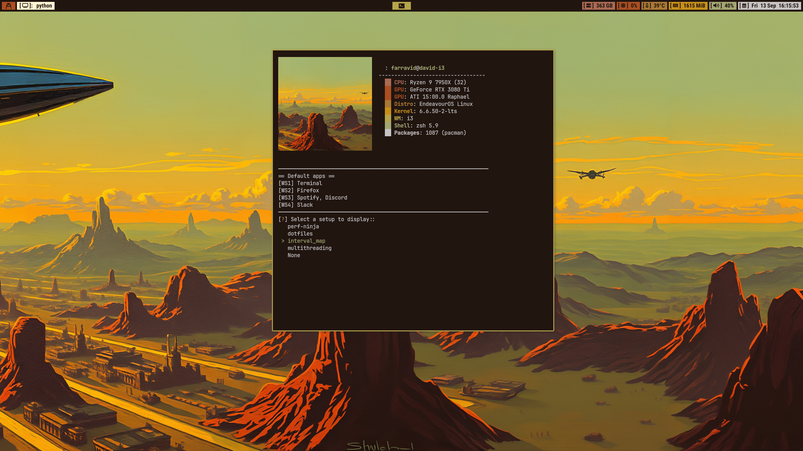

<div align="center">
  <h1>dotfiles</h1>
  
  
  
  <p></p>  
</div>

<div align="center">
  
  <p>
    <sub>
      My EndeavourOS-i3 startup script
    </sub>
  </p>
</div>

# Setup
You only need to clone the repository on your home folder and run the install script.
```shell
cd ~ 
git clone --recurse-submodules https://github.com/Farravid/.dotfiles.git
cd .dotfiles
./scripts/install.sh
```

